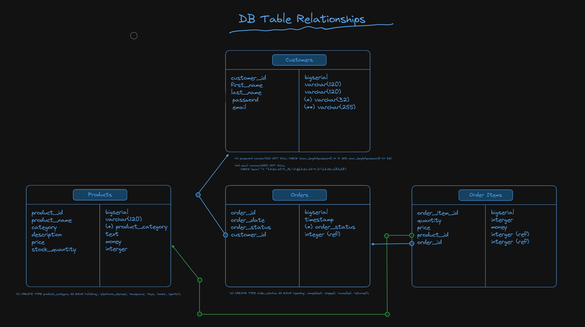

# Simple e-Commerce App

### Core Features

- **Login/Register**: Simple salt-less password-based Auth (not JWT, 0Auth2, etc.).
- **CRUD Operation on**: Customers, Products, Orders and Order Items
- **DB Schema**: 

## Getting this Repo and setting it up (For the Beginners)

### Things you must install


1. Go (Programming Language) [Official download link](https://go.dev/doc/install)


2. PostgreSQL (Database Server), see this: [PostgreSQL README](./internal/database/sql/README.md)


3. Node.js the most popular Javascript runtime [NodeJS](https://nodejs.org/en)


4. (Recommended) Use pnpm instead of npm. To download it go [here](https://pnpm.io/installation)

Once you downloaded and installed everything...

1. Create an empty directory (folder).
2. Navigate there using your terminal.
3. Copy and paste this command to download the project's code from GitHub:

```
git clone https://github.com/jimzord12/simple-ecommerce-app.git
```

Now you can read the **Frontend** and **Backend** READMEs to proceed.

## Frontend

### Technologies

- Next.js 14

Frontend [README](./frontend/my-app/README.md)

## Backend

### Technologies

- **Web Server**: Go's http/net + chi

Web Server [README](./backend/e-commerce-app/README.md)

- **Database**: PostgreSQL (_local installation, not Docker Container_)

Database [README](./backend/e-commerce-app/internal/database/sql/README.md)
