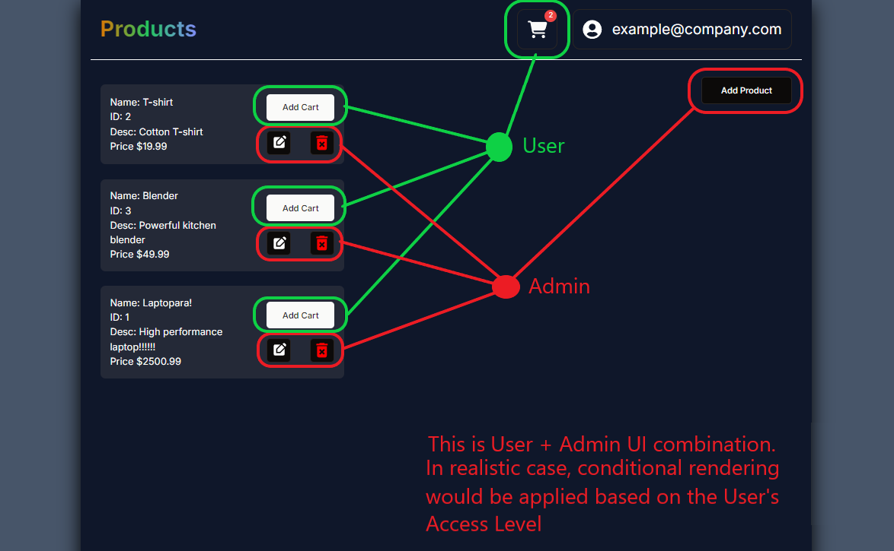

## Some Pics 📷





This is a [Next.js](https://nextjs.org/) project bootstrapped with [`create-next-app`](https://github.com/vercel/next.js/tree/canary/packages/create-next-app).

## Requirements

- The installation of a modern version of [Node.js](https://nodejs.org/en)
- (Recommended) The use of **pnpm** instead of **npm**. To download it, [go here](https://pnpm.io/installation)

## Getting Started

First, run the development server:

```bash
npm run dev
# or
pnpm dev (recommended)
# or
```

Open [http://localhost:3000](http://localhost:3000) with your browser to see the result.

## ⚠ Important - Uncomment `.env.local` at `.gitignore`

For convenience, I have have allowed my `.env.local` file to be uploaded to Github.

However, you should NOT! Therefore, find a file named `.gitignore` in `frontend/my-app`

Go to **line 29** and uncomment it.

## Purpose

To create a simple, yet completely functional Frontend using Next.js 14.

Using all new features and applying best practises was not the project's main objective.

## What's worth exploring

1. How to use some complex components of the popular `shadcn/ui` UI Component Library.

   - **Form**: Create and Validate afForm using `zod` + `react-hook-form` libraries
   - **Drawer**: Create a dynaminc (opening/closing) Cart sidebar using the `Drawer` component

2. In Next.js 14, how to create/use:

   - Context Providers
   - App Router (to create web pages)
   - API Route Handlers

3. Uncommon Tailwindcss styling

   - For instance, in the Home Page I used: `peer/auth` and `peer-hover/auth` to change the behavior of one element based on the state of another. Additionally, I also used `order-x` to overcome a restriction that `peer/xxxx` has.
